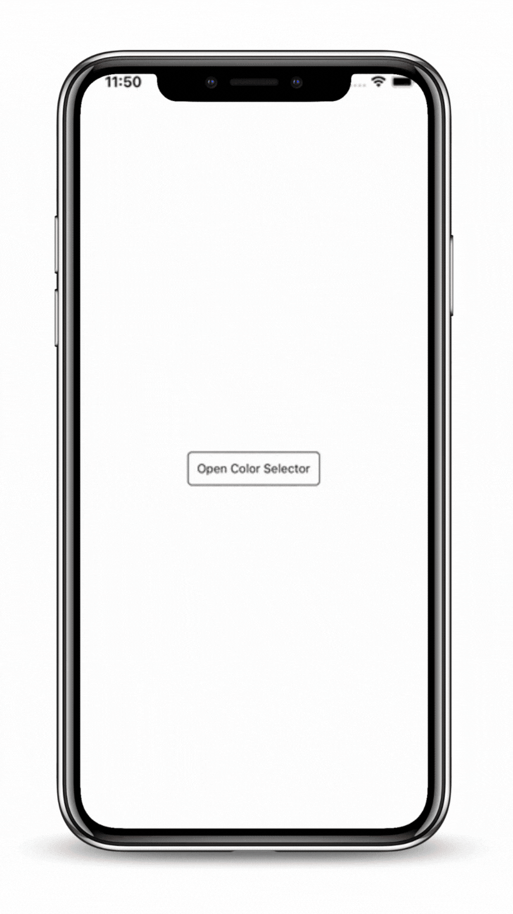
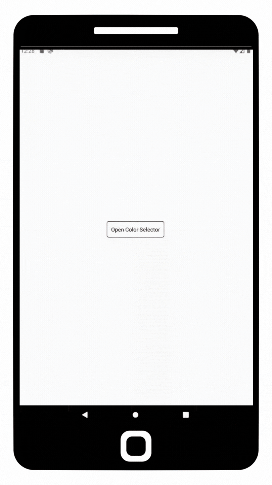

<p align="center">
  <h1 align="center"> <code>@react-native-d5m/rn-color-selector</code> </h1>
</p>
An elegant color selector solution for React Native apps. Clean and simple to implement.

<br>Currently supported on following platforms:
</p>

|                        iOS                         |                          Android                           |
| :------------------------------------------------: | :--------------------------------------------------------: |
|  |  |

## Installation & Usage

To install this module `cd` to your project directory and enter the following command:
```
yarn add @react-native-d5m/rn-color-selector
```
or
```
npm install @react-native-d5m/rn-color-selector
```

### Installing dependencies

In your project directory, run:

```
npm install @react-native-community/slider react-native-linear-gradient
```

<b>NOTE:</b> If using iOS please remember to install cocoapods by running: `npx pod-install` in your project directory.
<br/>
<br/>

The following code presents the 3 basic usage scenarios of this library:

#### useSelector({})

Allows display of the color selector anywhere in your app. The color selector initially shows a default set of colors to choose from `<ColorSelector />`, or if the color wheel is selected, the `AdvancedColorSelector />` is displayed where the user can choose any color they desire, including typing in a color in all formats.


#### Wrap your app with the `<ColorSelectorProvider>` if you intend on using the `useColorSelector`

```javascript
import { ColorSelectorProvider } from '@react-native-d5m/rn-color-selector';

return (
    <ColorSelectorProvider> 
        <YourApp />
    </ColorSelectorProvider>
)

```

#### Use `useColorSelector` anywhere within your app

```javascript
import { useSelector } from '@react-native-d5m/rn-color-selector';

const openColorSelector = useColorSelector();

const showColorSelector = () => {
    openColorSelector({
        outputColor: (hexColor) => {
            // Do something with hexColor
        }
    });
}
```

#### <ColorSelector /\>

Allows display of the `<ColorSelector />` where inserted into the code. This component initially shows a default set of colors to choose from `<ColorSelector />`, or if the color wheel is selected, the `AdvancedColorSelector />` is displayed where the user can choose any color they desire, including typing in a color in all formats. 

```javascript
import { ColorSelector } from '@react-native-d5m/rn-color-selector';

return (
    <ColorSelector
        outputColor={(hexColor)=>{
            // Do something with hexColor
        }}
    />
);
```

#### <AdvancedColorSelector /\>

Allows display of the `<AdvancedColorSelector />` where inserted into the code. This component allows usage of only the color pad where the user can choose any color they desire, including typing in a color in all formats.

```javascript
import { AdvancedColorSelector } from '@react-native-d5m/rn-color-selector';

return (
    <AdvancedColorSelector
        outputColor={(hexColor)=>{
            // Do something with hexColor
        }}
    />
);
```

---

## Properties
<br/> <br/>
### useSelector({})

| Property       | Description                                                                                                                                                                                                                                                                                                                                                                                                                                                   | Type     | Required | Platform     |
| -------------- | ------------------------------------------------------------------------------------------------------------------------------------------------------------------------------------------------------------------------------------------------------------------------------------------------------------------------------------------------------------------------------------------------------------------------------------------------------------- | -------- | -------- | ------------ |
| `outputColor`  | Outputs the selected color with any color interaction in hex. <br/> <br/>The useSelector accepts an object with 2 arguments, outputColor and onPressColor. <br/> <br/>The `outputColor` argument is a function which passes the selected color to be used in hex. Both ColorSelector and AdvancedColorSelector colors are passed. (See usage example above.)                                                                                                  | function | No       | iOS, Android |
| `onPressColor` | Used to get the selected color from a chosen color from the ColorSelector and the chosen color from the AdvancedColorSelector when the "Done" button is pressed. <br/><br/>The useSelector accepts an object with 2 arguments, outputColor and onPressColor. <br/> <br/>The `onPressColor` argument is a string which passes the selected color to be used in hex. Both ColorSelector and AdvancedColorSelector colors are passed. (See usage example above.) | string   | No       | iOS, Android |

<br/> <br/>
### <ColorSelector /\>

| Property           | Description                                                                                                                                                                                                                                                                                      | Type                                                    | Required | Platform     |
| ------------------ | ------------------------------------------------------------------------------------------------------------------------------------------------------------------------------------------------------------------------------------------------------------------------------------------------ | ------------------------------------------------------- | -------- | ------------ |
| `containerStyle`   | Used to style and layout the `<ColorSelector />`. As per the name this only affect the style of the container which holds the color buttons.                                                                                                                                                     | View.style                                              | No       | iOS, Android |
| `titleStyle`       | The text style (object) of the titles of the `<ColorSelector />`.                                                                                                                                                                                                                                 | bool                                                    | No       | iOS, Android |
| `cancelTitle`      | The name of the "Cancel" button on the `<ColorSelector />`. Default is "Cancel".                                                                                                                                                                                                                 | string                                                  | No       | iOS, Android |
| `shouldShowCancel` | Whether to show the "Cancel" button on `<ColorSelector />` component.   <br/><br/> <b>Note:</b> If `onPressCancel` is not given a function the "Cancel" button will also not show.                                                                                                               | bool                                                    | No       | iOS, Android |
| `onPressCancel`    | Callback that is called when the user presses the cancel button.     <br/><br/> <b>Note:</b> If `onPressCancel` is not given a function the "Cancel" button will also not show.                                                                                                                  | function                                                | No       | iOS, Android |
| `colorsArray`      | An array of section color objects to show as the default colors plus additional sections such as "Saved Colors" and "Recents Colors". Default colors are provided if this property is null. Uses `SectionList` format for data. (See Reference [colorsArray](#colorsarray) below for an example) | array  [color](https://reactnative.dev/docs/colors)     | No       | iOS, Android |
| `useDefaultColors`     | If true, default colors will be used in addtion to any `colorsArray` indicated via the `colorsArray` property. If false, the `colorsArray` property replaces the default colors.                                                                                                                                                                                          | bool   | No       | iOS, Android |
| `initialColor`     | The initial color that will appear on the `<AdvancedColorSelector />` when the color wheel is selected.                                                                                                                                                                                          | string     [color](https://reactnative.dev/docs/colors) | No       | iOS, Android |
| `onSelectColor`    | Callback that is called wheneven a user selects a default color in the `<ColorSelector />` or when the user selects a color on the `<AdvancedColorSelector />` and the user presses "Done". Value passed is the selected color.                                                                  | function                                                | No       | iOS, Android |
| `outputColor`      | Callback that is called whenever a user selects a new color in the `<ColorSelector />` or as the user is actively dragging their finger on the color pad in `<AdvancedColorSelector />`. Value passed is the selected color.                                                                     | function                                                | No       | iOS, Android |

<br/> <br/>
### <AdvancedColorSelector /\>

| Property         | Description                                                                                                                                                                                           | Type                                                  | Required | Platform     |
| ---------------- | ----------------------------------------------------------------------------------------------------------------------------------------------------------------------------------------------------- | ----------------------------------------------------- | -------- | ------------ |
| `containerStyle` | Used to style and layout the `<AdvancedColorSelector />`. As per the name this only affect the style of the container which holds the color buttons.                                                  | View.style                                            | No       | iOS, Android |
| `colorPadStyle`  | Used to style and layout the color touch pad in `<AdvancedColorSelector />`.                                                                                                                          | View.style                                            | No       | iOS, Android |
| `shouldShowDone` | Whether to show the "Done" button on `<AdvancedColorSelector />` component.   <br/><br/> <b>Note:</b> If `onPressDone` is not given a function the "Done" button will also not show.                  | bool                                                  | No       | iOS, Android |
| `doneTitle`      | The title of the "Done" button on the `<AdvancedColorSelector />`. Default is "Done".                                                                                                                 | string                                                | No       | iOS, Android |
| `onPressDone`    | Callback that is called whe the "Done" button is pressed.     <br/><br/><b>Note:</b> If `onPressDone` is not given a function the "Done" button will also not show.                                   | function                                              | No       | iOS, Android |
| `height`         | The height of the color pad on the       `<AdvancedColorSelector />`. Default is 150.                                                                                                                 | number                                                | No       | iOS, Android |
| `onTextFocus`    | Callback that is called when the user selects the `<TextInput />` to type in a color.                                                                                                                 | function                                              | No       | iOS, Android |
| `onEndEditing`   | Callback that is called when the user finishes entering a color in the `<TextInput />`.                                                                                                               | function                                              | No       | iOS, Android |
| `initialColor`   | The initial color that will appear on the color pad in the `<AdvancedColorSelector />` component.                                                                                                     | string   [color](https://reactnative.dev/docs/colors) | No       | iOS, Android |
| `outputColor`    | Callback that is called as the user is actively dragging their finger on the color pad in `<AdvancedColorSelector />` or when the user presses the "Done" button. Value passed is the selected color. | string [color](https://reactnative.dev/docs/colors)   | No       | iOS, Android |


<br/><br/>
## Reference

### colorsArray:
```javascript

colorsArray = {
    [
        {
            title: "Recent Colors",
            data: [
                {
                    colors: [
                        "blue",
                        "red",
                        "white"
                    ]
                }
            ]
        },
        {
            title: "Saved Colors",
            data: [
                {
                    colors: [
                        "yellow",
                        "green",
                         "purple"
                    ]
                }
            ]
        }
    ]
};
```

## Contributing

When [creating an issue](https://github.com/react-native-d5m/rn-color-selector/issues) please remember to specify the platform which the issue occurs on.
<br/> <br/>
## Maintainers

- [Noel Beharry](https://github.com/coldfireuc) - [Double5Media](https://double5media.com/)
<br/> <br/>
## Contributors

This module includes extracted module  [react-native-color](https://github.com/hectahertz/react-native-color) and was updated to work with the latest versions of react native.

---

## Created by Double5Media with CodeLove❤️...

`@react-native-d5m/color-selector` is an open source project and is free to use. If you found this module useful, please star it 🌟.

Feeling appreciative and want more? 

[Donate](https://) to keep updates and more fresh React Native Modules coming! 💪
